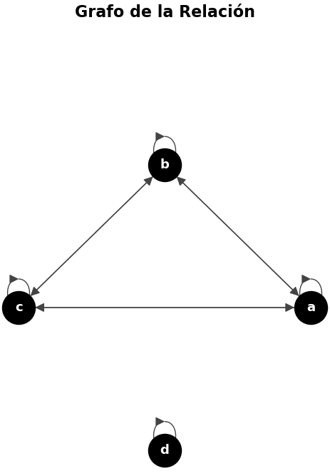

# Visualizador de Relaciones Binarias

Este proyecto permite analizar y graficar relaciones binarias sobre un conjunto finito de elementos. El script principal calcula las propiedades de **Reflexividad**, **Simetría** y **Transitividad**, generando un grafo dirigido y una visualización clara de los resultados.

### Requisitos Previos

Asegúrate de tener Python 3.10 o superior instalado. Se recomienda el uso de un entorno virtual.

```bash
# Instalación de dependencias
pip install -r requirements.txt
```

### Estructura del Proyecto

* `relaciones.py`: Script principal de análisis matemático y visualización.
* `relaciones_aleatorias.py`: Módulo que genera conjuntos y relaciones al azar con tendencias a cumplir ciertas propiedades.
* `requirements.txt`: Lista de librerías necesarias (`numpy`, `networkx`, `matplotlib`).

### Uso

Para iniciar el programa, ejecuta en tu terminal:

```bash
python relaciones.py
```

### Modos de Entrada

* **Manual (`y`):**
  * Ingresa los elementos del conjunto separados por espacios (ej. `a b 100 200`).
  * Ingresa las relaciones en formato $aRb$ (ej. `aR100 100R200 bRa`).
* **Aleatorio (`n`):**
  * Ingresa el número de elementos deseado. El script generará automáticamente los identificadores y una estructura de relaciones al azar.

### Salida del Programa

El script imprimirá en consola el estatus de las propiedades evaluadas y abrirá una ventana de Matplotlib mostrando:
* El Grafo Dirigido que representa la relación.
* Un panel resumen indicando si la relación cumple con Reflexividad, Simetría y Transitividad.

---

# Análisis Matemático

Para este problema, se modelaron las relaciones binarias utilizando la teoría de grafos. El conjunto de elementos de la relación corresponde al conjunto de vértices del grafo dirigido, y el conjunto de relaciones corresponde a las aristas dirigidas. De esta manera, una relación $aRb$ se representa como una arista $a \to b$, y una relación reflexiva $aRa$ se representa como un bucle $a \to a$.

Para facilitar el análisis computacional de las propiedades, el programa construye y evalúa la **matriz de adyacencia** del grafo generado.

### Ejemplo Práctico

Para ilustrar el funcionamiento lógico del script, analizaremos un ejemplo sobre un conjunto de 4 elementos que forma una relación de equivalencia (cumple con las tres propiedades). Crearemos dos clases de equivalencia distintas: los elementos `a`, `b`, y `c` estarán relacionados entre sí, mientras que el elemento `d` estará aislado, relacionándose únicamente consigo mismo.

El código crea una matriz de ceros utilizando la librería NumPy y la llena con unos (`1`) verificando los pares en el conjunto de relaciones:

```python
n = len(Elementos)

Matriz = np.zeros((n, n), dtype=int)
for a, b in ConjuntoRelaciones:
    Matriz[Elementos[a]][Elementos[b]] = 1
```

* **Conjunto de elementos ($A$):** $\{a, b, c, d\}$
* **Conjunto de relaciones ($R$):** $\{(a,a), (b,b), (c,c), (d,d), (a,b), (b,a), (b,c), (c,b), (a,c), (c,a)\}$

La matriz de adyacencia $M$ resultante es:

$$
M = \begin{bmatrix}
1 & 1 & 1 & 0 \\
1 & 1 & 1 & 0 \\
1 & 1 & 1 & 0 \\
0 & 0 & 0 & 1
\end{bmatrix}
$$

Y su representación en grafo sería la siguiente:



A continuación, se detalla cómo el programa evalúa cada propiedad basándose en esta matriz.

---

## 1. Reflexividad e Irreflexividad

**Definición de Reflexividad:**
Se dice que una relación $R$ sobre un conjunto $A$ es reflexiva si todo elemento de $A$ está relacionado consigo mismo.
$$ \forall a \in A, (a, a) \in R $$

**Definición de Irreflexividad:**
Una relación $R$ es irreflexiva si ningún elemento de $A$ está relacionado consigo mismo.
$$ \forall a \in A, (a, a) \notin R $$

En nuestra matriz de adyacencia, comprobar estas propiedades equivale a inspeccionar exclusivamente la diagonal principal (las entradas $M_{i,i}$). Si todos los elementos de la diagonal son $1$, existe una arista $a \to a$ para cada vértice, por lo que la relación es reflexiva. Si todos son $0$, la relación es irreflexiva. Si hay una combinación de ambos, no cumple ninguna de las dos.

El programa implementa esto iterando sobre la diagonal:

```python
num_1 = 0
num_0 = 0

for a in range(n):
    if Matriz[a][a] == 1:
        num_1 += 1
    elif Matriz[a][a] == 0:
        num_0 += 1

if num_1 == n:
    Reflexividad = 'Reflexiva'
elif num_0 == n:
    Reflexividad = 'Irreflexiva'
else:
    Reflexividad = 'Ni Reflexiva Ni Irreflexiva'
```

**Evaluación en nuestro ejemplo:**
Si extraemos la diagonal de la matriz $M$, obtenemos: $\text{Diagonal} = [1, 1, 1, 1]$.
Al contar los unos, el resultado es $4$, que coincide con el total de elementos ($n = 4$). Por lo tanto, el programa concluye correctamente que la relación es **Reflexiva**.

---

## 2. Simetría

**Definición de Simetría:**
Una relación $R$ sobre un conjunto $A$ es simétrica si, siempre que un elemento $a$ está relacionado con $b$, entonces $b$ también está relacionado con $a$.
$$ \forall a, b \in A, (a, b) \in R \implies (b, a) \in R $$

En el modelo de grafos, esto significa que por cada arista $a \to b$, debe existir la arista $b \to a$. En términos de la matriz de adyacencia, se debe cumplir que para toda posición, la entrada $M_{a,b}$ sea igual a la entrada $M_{b,a}$. En álgebra lineal, esto equivale a comprobar que la matriz es simétrica respecto a su diagonal principal, es decir, que la matriz es igual a su matriz transpuesta ($M = M^T$).

El script verifica esta condición de forma directa con NumPy:

```python
if np.array_equal(Matriz, Matriz.T):
    Simetria = 'Simétrica'
else:
    Simetria = 'No Simétrica'
```

**Evaluación en nuestro ejemplo:**
Al calcular la matriz transpuesta $M^T$ (intercambiando filas por columnas), observamos que no hay cambios:

$$
M^T = \begin{bmatrix}
1 & 1 & 1 & 0 \\
1 & 1 & 1 & 0 \\
1 & 1 & 1 & 0 \\
0 & 0 & 0 & 1
\end{bmatrix}
$$

Dado que $M = M^T$, el programa confirma que la relación es **Simétrica**.

---

## 3. Transitividad

**Definición de Transitividad:**
Una relación $R$ es transitiva si, siempre que un elemento $a$ se relaciona con $b$, y $b$ se relaciona con $c$, entonces $a$ también debe estar relacionado con $c$.
$$ \forall a, b, c \in A, ((a, b) \in R \land (b, c) \in R) \implies (a, c) \in R $$

Para evaluar esto computacionalmente de forma eficiente, no basta con revisar las relaciones directas. Nos apoyaremos en un principio del álgebra de grafos:

**Teorema de las Potencias de la Matriz de Adyacencia**
> Sea un grafo dirigido con matriz de adyacencia $M$. La entrada en la fila $i$ y columna $j$ de la matriz $M^k$ (con $k$ entero positivo) representa el número exacto de caminos de longitud $k$ que van desde el vértice $i$ hasta el vértice $j$.

Si calculamos $M^2$, cada entrada $M^2_{i,j}$ nos indicará cuántos caminos de longitud 2 (es decir, que pasan por un vértice intermedio $i \to k \to j$) existen. La transitividad nos exige que, si existe al menos un camino intermedio entre dos nodos (si la entrada $M^2_{i,j} > 0$), entonces obligatoriamente debe existir un camino directo que los conecte (la entrada $M_{i,j} > 0$).

El programa eleva la matriz al cuadrado y realiza esta comparación lógica elemento por elemento:

```python
Matriz_2 = np.linalg.matrix_power(Matriz, 2)
EsTransitiva = np.all((Matriz_2 > 0) <= (Matriz > 0))

if EsTransitiva:
    Transitividad = 'Transitiva'
else:
    Transitividad = 'No Transitiva'
```

**Evaluación en nuestro ejemplo:**
Calculamos la matriz al cuadrado $M^2$:

$$
M = \begin{bmatrix}
1 & 1 & 1 & 0 \\
1 & 1 & 1 & 0 \\
1 & 1 & 1 & 0 \\
0 & 0 & 0 & 1
\end{bmatrix}
\implies
M^2 = \begin{bmatrix}
3 & 3 & 3 & 0 \\
3 & 3 & 3 & 0 \\
3 & 3 & 3 & 0 \\
0 & 0 & 0 & 1
\end{bmatrix}
$$

Al comparar ambas matrices, verificamos que en cada posición donde $M^2$ tiene un valor positivo (los números `3` y el `1`), la matriz original $M$ también tiene un valor positivo en esa misma posición. Al cumplirse esta condición en todas las entradas, el programa determina que la relación es **Transitiva**.